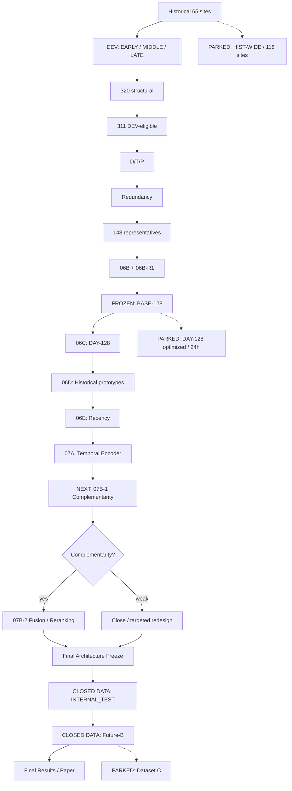
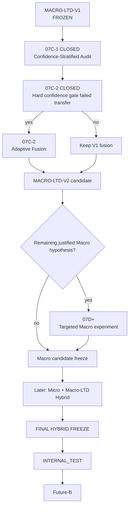

# LTD-Attack — Experimental Roadmap

> Documento vivo. Actualizar al cierre de cada etapa.

## Estados

| Estado | Significado |
|---|---|
| CLOSED | Ejecutado, validado y documentado |
| FROZEN | Artefacto congelado |
| ACTIVE | Linea actualmente en desarrollo |
| NEXT | Proximo experimento |
| PARKED | Rama prometedora aplazada |
| CLOSED DATA | Holdout aun no abierto |

## Flujo experimental

## Registro

| Etapa | Estado | Resultado |
|---|---|---|
| Split temporal | CLOSED | DEV_EARLY / DEV_MIDDLE / DEV_LATE; INTERNAL_TEST aislado |
| Eligibility | CLOSED | 320 -> 311 |
| D/T/P + redundancy | CLOSED | 311 -> 148 dimensiones efectivas |
| 06B + 06B-R1 | CLOSED | TOP-128 confirmado |
| BASE-128 | FROZEN | baseline single-capture principal |
| 06C | CLOSED | 2,653 perfiles DAY-128 / 41 fechas |
| 06D | CLOSED | contexto historico aporta ranking |
| 06E | CLOSED | recent-7 ayuda con mas historia, no de forma uniforme |
| 07A | CLOSED | LTD mejora ranking/Top-5, no Top-1/F1 robustamente |
| 07B-1 | CLOSED | complementarity confirmed; oracle gain ~+7.7 to +7.9 pp |
| 07B-2A | CLOSED | geometric fusion alpha=0.375; positive temporal transfer |
| 07B-2R | CLOSED | fixed-fusion robustness audit; no architecture tuning |
| INTERNAL_TEST | CLOSED DATA | abrir una sola vez tras freeze |
| Future-B | CLOSED DATA | benchmark externo tras INTERNAL_TEST |
| DAY-128 optimized | PARKED | rama 24h |
| HIST-WIDE / 118 sites | PARKED | extension posterior |
| Dataset C | PARKED | benchmark virgen |

## Resultados clave

### BASE-128 + XGBoost
- Fold A: Accuracy ~73.69%, Macro-F1 ~73.11%
- Fold B: Accuracy ~76.74%, Macro-F1 ~75.36%

### DAY-128
- 2,653 site-day profiles, 41 fechas, ~99.55% coverage
- Fold B: Accuracy ~66.63%, Macro-F1 ~64.28%, Top-5 ~88.64%

### 06D Historical Prototype
- Fold B single-capture: Accuracy ~22.61%, Top-5 ~59.04%, MRR ~0.392

### 06E Recent-7
Fold B vs static:
- Accuracy +3.00 pp
- Macro-F1 +2.74 pp
- Top-5 +1.55 pp
- MRR +0.027
- Mean rank 8.72 -> 7.22

### 07A Temporal Encoder
Fold A:
- BASE-MLP F1 ~60.61%, Top-5 ~88.90%
- LTD F1 ~59.74%, Top-5 ~89.20%

Fold B:
- BASE-MLP F1 ~66.88%, Top-5 ~93.23%
- LTD F1 ~66.41%, Top-5 ~95.19%

Conclusion: LTD no reemplaza BASE directamente; aporta ranking complementario.

## Camino activo

07B-1 CLOSED -> 07B-2A CLOSED -> 07B-2R CLOSED -> MACRO-LTD-V1 FROZEN -> MACRO-LTD-V2 EXPLORATION

## Regla de cierre

Una etapa solo se considera CLOSED cuando:
1. todos los runs declarados fueron ejecutados;
2. leakage audit paso;
3. evidencia fue guardada;
4. resultados fueron interpretados;
5. decision/status fue documentado;
6. existe commit normal, sin amend ni force.

## 07B-1 Decision Gate

Pregunta: **Cuando BASE-XGB falla, LTD contiene informacion complementaria?**

Medidas:
- both correct
- XGB-only correct
- LTD-only correct
- both wrong
- oracle union
- rescue rate
- true-class rank improvement
- Top-5 overlap
- per-class rescues

Solo pasar a 07B-2 si hay rescue pool no trivial o complementariedad clara de ranking.

## Holdout rule

DEV -> Final Architecture Freeze -> INTERNAL_TEST -> Future-B

Despues de abrir INTERNAL_TEST no se cambia feature set, arquitectura,
context window, preprocessing ni regla de fusion a partir de sus resultados.

## Macro Continued Exploration

MACRO-LTD-V1 is a frozen milestone, not the end of the Macro research line.

Rule:
- MACRO-LTD-V1 is immutable.
- Improvements are developed as MACRO-LTD-V2+.
- All V2 development remains DEV-only.
- INTERNAL_TEST remains closed.
- Future-B remains closed.
- The future Micro/Hybrid phase remains planned but does not stop Macro exploration.

### MACRO-LTD-V1

Status: FROZEN DEV MILESTONE.

Configuration:
- MACRO-V2-BASE-128
- XGBoost BASE
- LTDPairScorer
- 7-day candidate context
- LTD seeds: 11, 42, 73
- mean probability ensemble
- geometric fusion alpha = 0.375

Robustness:
- Fold A: Accuracy improves on 14/14 dates
- Fold B: Accuracy improves on 13/13 dates
- Fold B delta Accuracy: +2.72 pp
- Fold B delta Macro-F1: +2.57 pp
- alpha near-optimal region: 0.30–0.40

Remaining weakness:
- gains are heterogeneous across classes;
- Fold-A Macro-F1 improvement is modest;
- Fold-A Top-5 decreases;
- fixed global alpha may over-trust LTD for some queries/classes.

Next:
07C-1 Confidence-Stratified Fusion Audit.

Goal:
determine whether the optimal contribution of LTD depends on
BASE-XGB confidence, disagreement, entropy or margin.

The result will determine whether MACRO-LTD-V2 should use
query-adaptive fusion instead of the global alpha=0.375.

### 07C-1 result:

Adaptive signal confirmed.

- Fold-B low-confidence fusion gain: +6.53 pp average
- Fold-B high-confidence fusion gain: +0.08 pp average
- Fold-B disagreement net correct: +507
- confidence thresholds were defined only on Fold A

Next:
07C-2 Confidence-Gated Fusion.

### 07C-2 result

Hard confidence gating did not transfer.

- Fold A: small improvement over MACRO-LTD-V1
- Fold B: Accuracy -0.64 pp
- Fold B: Macro-F1 -0.53 pp
- Fold B net correct: -120

Decision:
retain MACRO-LTD-V1.

No post-hoc threshold adjustment using Fold B.

### 07D-1 ACTIVE — LTD Context-Length Ablation

Question:
Is the frozen 7-day context optimal for the longitudinal component?

Candidate windows:
1, 3, 5, 7 days.

Protocol:
- all candidate windows evaluated on Fold A;
- select exactly one window using Fold-A Macro-F1;
- Freeze selected window;
- only the selected window is then evaluated on Fold B;
- XGB and fusion alpha=0.375 remain unchanged;
- INTERNAL_TEST and Future-B remain closed.

### 07D-1 result

Context-length ablation passed.

Selected:
- context = 5 days

Versus MACRO-LTD-V1 context=7:

Fold A:
- Accuracy +0.09 pp
- Macro-F1 +0.04 pp

Fold B temporal transfer:
- Accuracy +0.34 pp
- Macro-F1 +0.41 pp
- MRR +0.18 pp

Candidate:
MACRO-LTD-V2 = MACRO-LTD-V1 with context 5.

Important:
all contexts retained the same number of causal training queries.
The gain is therefore contextual/representational, not caused by
additional training data.

Status:
07D-1 CLOSED — POSITIVE.

Next:
07D-1R CLOSED — promotion gate passed.

### MACRO-LTD-V2

Status:
FROZEN DEV MILESTONE.

Difference from V1:
- longitudinal context: 7 -> 5 site-days

Unchanged:
- BASE-128
- XGBoost
- LTD architecture
- seeds [11,42,73]
- geometric fusion alpha=0.375

Fold-B DEV:
- Accuracy: 79.80%
- Macro-F1: 78.34%
- Top-5: 96.93%
- MRR: 0.8701

Paired Fold-B gain vs V1:
- Accuracy: +0.34 pp
- Macro-F1: +0.41 pp
- MRR: +0.18 pp
- net correct: +63

11/13 dates improve Accuracy.

Next:
07E-1 ACTIVE — Temporal Order Ablation.

Question:
Does ordered temporal information itself contribute beyond having the
same set of five historical daily profiles?

Control:
same architecture, same capacity, same W=5, but without positional encoding.

## Master Research Plan

The experimental program is divided into bounded phases.

### Phase P0 — Provenance and leakage control — CLOSED
Historical-only feature design, chronological DEV splits and immutable evidence.

### Phase P1 — Static Macro representation — CLOSED
Structural features -> D/T/P -> redundancy -> BASE-128.

### Phase P2 — Strong Macro baseline — CLOSED
BASE-128 + XGBoost.

### Phase P3 — Longitudinal Macro — CLOSED
Historical prototypes, recency and candidate-conditioned LTD.

### Phase P4 — Macro fusion — CLOSED
Complementarity audit and geometric BASE-XGB/LTD fusion.

### Phase P5 — Macro refinement — CLOSED
V1 context=7.
V2 context=5.
Temporal-order ablation completed.
Next hypothesis: explicit query-to-history age/staleness.

Macro stop rule:
after the explicit age/staleness experiment, continue with at most one
additional Macro architecture hypothesis only if a concrete failure mode
is identified prospectively. Otherwise freeze the strongest Macro milestone.

### Phase P6 — Macro Final Freeze — CLOSED — CLOSED
Select the strongest reproducible DEV Macro architecture.

### Phase P7 — Clean Micro temporal baseline — CLOSED — ACTIVE
Rebuild Micro under the same chronological 65-site protocol.

### Phase P8 — Micro/Macro complementarity — ACTIVE
Measure both-correct, Micro-only, Macro-only, oracle union, ranks and rescues.

### Phase P9 — Hybrid development
Start with calibrated probability fusion.
Use learned Cross-Attention/gating only if residual complementarity justifies it.

### Phase P10 — Final Hybrid Freeze
Freeze all features, architectures, preprocessing and fusion rules.

### Phase P11 — INTERNAL_TEST
One-time historical holdout evaluation.
No architecture changes based on its result.

### Phase P12 — Future-B
One-time external temporal-drift benchmark.

### Phase P13 — Dataset C
Preferred truly untouched external longitudinal benchmark.

### Phase P14 — Sensitivity / extensions
HIST-WIDE 118-site cohort, DAY/24h branch and secondary analyses.

Primary target:
a temporally robust hybrid Website Fingerprinting model combining
current-session Micro information with longitudinal Macro dynamics.

### 07E-1 result

Status:
CLOSED — ORDER EFFECT INCONCLUSIVE.

Fold B strongly favors ordered W=5, but Fold A does not reproduce the
Top-1 / Macro-F1 advantage.

MACRO-LTD-V2 remains frozen.

Next:
07F-1 ACTIVE — Query-Age-Aware LTD.

### 07F-1 result

Status:
CLOSED — NEGATIVE.

Query-age encoding degraded MACRO-LTD-V2 in both temporal folds.

Important diagnostic:

training histories are predominantly fresh, whereas frozen evaluation
histories become progressively stale.

This identifies a train/inference temporal-context mismatch.

### 07G-1 ACTIVE — Stale-Context Training

Final planned Macro hypothesis.

Question:

Can MACRO-LTD learn a more robust longitudinal identity if training
explicitly exposes it to candidate contexts that are older than the query?

Architecture:
unchanged from MACRO-LTD-V2.

Changed component:
training context sampling only.

Stop rule:

- positive robust transfer -> candidate V3 -> robustness audit -> MACRO FINAL;
- no robust transfer -> MACRO-LTD-V2 -> MACRO FINAL;
- no additional Macro architecture search after this stage.

### 07G-1 result

Status:
CLOSED — NEGATIVE.

Stale-context training degraded MACRO-LTD-V2 in both DEV temporal folds.

Decision:
the predeclared Macro stop rule is activated.

MACRO-LTD-V2 -> MACRO-LTD-FINAL.

No additional Macro architecture search.

## MACRO-LTD-FINAL

Status:
FROZEN DEV ARCHITECTURE.

Fold-B DEV:
- Accuracy: 79.80%
- Macro-F1: 78.34%
- Top-5: 96.93%
- MRR: 0.8701

Next:
Phase P7 — Clean Temporal Micro.

First stage:
08A — Micro/Macro Capture Alignment Audit.

### 08B result

Status:
CLOSED — CLEAN TEMPORAL MICRO BASELINE ESTABLISHED.

Fold A:
- Accuracy 77.54%
- Macro-F1 76.55%

Fold B:
- Accuracy 86.32%
- Macro-F1 85.75%
- Top-5 98.27%
- MRR 0.9146

Micro is stronger than MACRO-LTD-FINAL as a standalone classifier.

This does not answer whether the Macro representation contains
complementary information.

Next:

08C ACTIVE — exact capture-level Micro/Macro complementarity audit.

No model training.
No fusion tuning.
No holdout access.

### 08C result

Status:
CLOSED — STRONG COMPLEMENTARITY CONFIRMED.

Fold B:
- Micro Accuracy: 86.32%
- Macro Accuracy: 79.80%
- Oracle union: 93.61%
- Oracle headroom over Micro: +7.29 pp
- Macro rescues 53.29% of Micro errors

Fold A:
- Oracle headroom over Micro: +12.34 pp
- Macro rescues 54.95% of Micro errors

Conclusion:
Micro and Macro contain strongly complementary classification information.

### 08D ACTIVE — Simple Probability Fusion

Rule:
weighted geometric probability fusion.

Selection:
alpha chosen only on Fold A.

Transfer:
selected alpha applied unchanged to Fold B.

No new model training.
No class-specific gating.
No neural meta-model.

### 08E result

Status:
CLOSED — RESIDUAL STRUCTURE CONFIRMED.

Fold B:
- LTD-HYBRID-V1 Accuracy: 92.05%
- Hybrid errors: 1,484
- any-alpha oracle: 95.27%
- union Top-2: 97.35%
- union Top-3: 98.60%
- union Top-5: 99.53%
- 40.57% of Hybrid errors recoverable by some scalar alpha
- 80.93% of Hybrid errors occur during Micro/Macro disagreement

Decision:

08F ACTIVE — low-DOF query-adaptive alpha gate.

Predeclared follow-up:

08G — one final candidate-level learned reranker, justified by the
large gap between scalar-alpha headroom and candidate-ranking headroom.

No manual class-specific rules.

