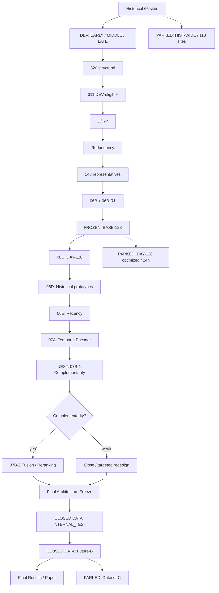
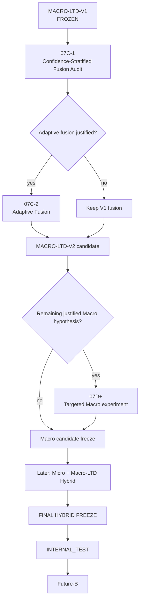

# LTD-Attack — Experimental Roadmap

> Documento vivo. Actualizar al cierre de cada etapa.

## Estados

| Estado | Significado |
|---|---|
| CLOSED | Ejecutado, validado y documentado |
| FROZEN | Artefacto congelado |
| ACTIVE | Linea actualmente en desarrollo |
| NEXT | Proximo experimento |
| PARKED | Rama prometedora aplazada |
| CLOSED DATA | Holdout aun no abierto |

## Flujo experimental

## Registro

| Etapa | Estado | Resultado |
|---|---|---|
| Split temporal | CLOSED | DEV_EARLY / DEV_MIDDLE / DEV_LATE; INTERNAL_TEST aislado |
| Eligibility | CLOSED | 320 -> 311 |
| D/T/P + redundancy | CLOSED | 311 -> 148 dimensiones efectivas |
| 06B + 06B-R1 | CLOSED | TOP-128 confirmado |
| BASE-128 | FROZEN | baseline single-capture principal |
| 06C | CLOSED | 2,653 perfiles DAY-128 / 41 fechas |
| 06D | CLOSED | contexto historico aporta ranking |
| 06E | CLOSED | recent-7 ayuda con mas historia, no de forma uniforme |
| 07A | CLOSED | LTD mejora ranking/Top-5, no Top-1/F1 robustamente |
| 07B-1 | CLOSED | complementarity confirmed; oracle gain ~+7.7 to +7.9 pp |
| 07B-2A | CLOSED | geometric fusion alpha=0.375; positive temporal transfer |
| 07B-2R | ACTIVE | fixed-fusion robustness audit; no architecture tuning |
| INTERNAL_TEST | CLOSED DATA | abrir una sola vez tras freeze |
| Future-B | CLOSED DATA | benchmark externo tras INTERNAL_TEST |
| DAY-128 optimized | PARKED | rama 24h |
| HIST-WIDE / 118 sites | PARKED | extension posterior |
| Dataset C | PARKED | benchmark virgen |

## Resultados clave

### BASE-128 + XGBoost
- Fold A: Accuracy ~73.69%, Macro-F1 ~73.11%
- Fold B: Accuracy ~76.74%, Macro-F1 ~75.36%

### DAY-128
- 2,653 site-day profiles, 41 fechas, ~99.55% coverage
- Fold B: Accuracy ~66.63%, Macro-F1 ~64.28%, Top-5 ~88.64%

### 06D Historical Prototype
- Fold B single-capture: Accuracy ~22.61%, Top-5 ~59.04%, MRR ~0.392

### 06E Recent-7
Fold B vs static:
- Accuracy +3.00 pp
- Macro-F1 +2.74 pp
- Top-5 +1.55 pp
- MRR +0.027
- Mean rank 8.72 -> 7.22

### 07A Temporal Encoder
Fold A:
- BASE-MLP F1 ~60.61%, Top-5 ~88.90%
- LTD F1 ~59.74%, Top-5 ~89.20%

Fold B:
- BASE-MLP F1 ~66.88%, Top-5 ~93.23%
- LTD F1 ~66.41%, Top-5 ~95.19%

Conclusion: LTD no reemplaza BASE directamente; aporta ranking complementario.

## Camino activo

07B-1 CLOSED -> 07B-2A CLOSED -> 07B-2R CLOSED -> MACRO-LTD-V1 FROZEN -> MACRO-LTD-V2 EXPLORATION

## Regla de cierre

Una etapa solo se considera CLOSED cuando:
1. todos los runs declarados fueron ejecutados;
2. leakage audit paso;
3. evidencia fue guardada;
4. resultados fueron interpretados;
5. decision/status fue documentado;
6. existe commit normal, sin amend ni force.

## 07B-1 Decision Gate

Pregunta: **Cuando BASE-XGB falla, LTD contiene informacion complementaria?**

Medidas:
- both correct
- XGB-only correct
- LTD-only correct
- both wrong
- oracle union
- rescue rate
- true-class rank improvement
- Top-5 overlap
- per-class rescues

Solo pasar a 07B-2 si hay rescue pool no trivial o complementariedad clara de ranking.

## Holdout rule

DEV -> Final Architecture Freeze -> INTERNAL_TEST -> Future-B

Despues de abrir INTERNAL_TEST no se cambia feature set, arquitectura,
context window, preprocessing ni regla de fusion a partir de sus resultados.

## Macro Continued Exploration

MACRO-LTD-V1 is a frozen milestone, not the end of the Macro research line.

Rule:
- MACRO-LTD-V1 is immutable.
- Improvements are developed as MACRO-LTD-V2+.
- All V2 development remains DEV-only.
- INTERNAL_TEST remains closed.
- Future-B remains closed.
- The future Micro/Hybrid phase remains planned but does not stop Macro exploration.

### MACRO-LTD-V1

Status: FROZEN DEV MILESTONE.

Configuration:
- MACRO-V2-BASE-128
- XGBoost BASE
- LTDPairScorer
- 7-day candidate context
- LTD seeds: 11, 42, 73
- mean probability ensemble
- geometric fusion alpha = 0.375

Robustness:
- Fold A: Accuracy improves on 14/14 dates
- Fold B: Accuracy improves on 13/13 dates
- Fold B delta Accuracy: +2.72 pp
- Fold B delta Macro-F1: +2.57 pp
- alpha near-optimal region: 0.30–0.40

Remaining weakness:
- gains are heterogeneous across classes;
- Fold-A Macro-F1 improvement is modest;
- Fold-A Top-5 decreases;
- fixed global alpha may over-trust LTD for some queries/classes.

Next:
07C-1 Confidence-Stratified Fusion Audit.

Goal:
determine whether the optimal contribution of LTD depends on
BASE-XGB confidence, disagreement, entropy or margin.

The result will determine whether MACRO-LTD-V2 should use
query-adaptive fusion instead of the global alpha=0.375.
