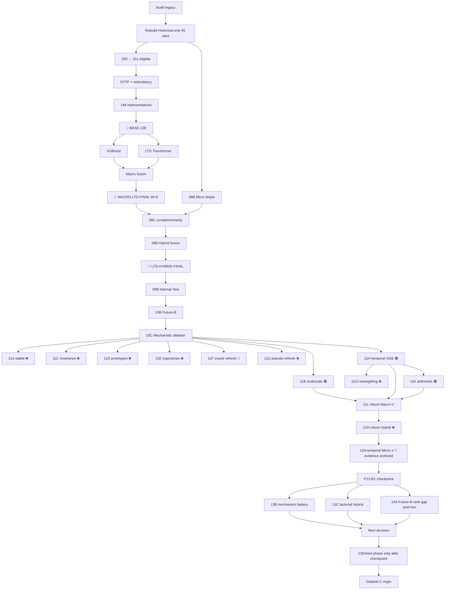
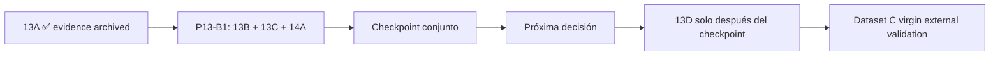

# LTD-Attack — Mapa completo de ramas, experimentos y decisiones

> **Documento vivo / source of truth de navegación experimental**
>
> Actualizado: **2026-10-04**  
> Rama revisada: `feature/macro-v2-historical-only`  
> Head remoto revisado: `1082eb31ad56c5f899333f2469ae68173c4e1718`
>
> Complementos:
> - [Mapa ejecutivo](./EXPERIMENT_MAP_EXEC.md)
> - [Registro maestro](./catalog/RESEARCH_BRANCHES.csv)
> - [Histórico de resultados](./RESULTS_HISTORY.md)
> - [Lineage técnico](./FEATURE_LINEAGE.md)
> - [Decisiones metodológicas](./DECISIONS.md)

## 0. Estado científico actual

| Elemento | Estado | Resultado |
|---|---|---|
| Cohorte canónica | 🧊 FROZEN | 65 sitios; Historical 72,603 capturas, 52 días |
| DEV | CLOSED | 57,916 capturas, 41 días |
| Internal Test | 🔓 OPEN/FROZEN | 14,687 capturas, 11 días; abierto una sola vez en 09B |
| Future-B | 🔓 OPEN/FROZEN | 18,543 capturas, 65 sitios; abierto en 10B |
| BASE Macro | 🧊 FROZEN | 128 features estructurales |
| Macro final base | 🧊 FROZEN | XGBoost + LTDPairScorer W=5; alpha LTD=.375 |
| Micro final base | 🧊 FROZEN | CNN + Transformer; 30 epochs; seed 42 |
| Hybrid final base | 🧊 FROZEN | Micro=.45 / Macro=.55 |
| Robust Macro | 🟢 RETAINED | 11L: TEMPORAL_SYMMETRIC3 + MULTISCALE5 |
| Robust Micro | 🧊 FROZEN / EVIDENCE ARCHIVED | 13A temporal expert ensemble |
| Próximo checkpoint | 🚧 NEXT | P13-B1: 13B + 13C + 14A → checkpoint conjunto |
| Dataset C | 🅿️ PARKED | validación externa virgen preferida |

### Métricas confirmatorias

| Modelo | Internal Test | Future-B same checkpoint |
|---|---:|---:|
| MICRO-FINAL | Acc 95.00%, F1 94.82% | Acc 43.12%, F1 44.14% |
| MACRO-LTD-FINAL | Acc 84.07%, F1 83.95% | Acc 22.30%, F1 18.33% |
| LTD-HYBRID-FINAL | Acc 97.44%, F1 97.38% | Acc 49.45%, F1 49.26% |

Hybrid Future-B Top-5 = **80.56%**.

---

## 1. Por qué se rehízo la línea

La auditoría del código mostró que las generaciones antiguas **MACRO-45** y **MACRO-94** estaban informadas por Future:

- MACRO-45: selección con comparación Historical/Future.
- MACRO-94: selección mediante KS Historical/Future; 94 variables de 310 con KS <= 0.15.
- Varias generaciones legacy tenían además problemas de preprocessing, scaler o split.

**Decisión:** conservar los resultados legacy como trazabilidad, pero no utilizarlos como evidencia canónica Static / Unseen Future.

### Resultados legacy relevantes

| Generación | Historical | Future | Estado |
|---|---:|---:|---|
| Micro legacy | 97.26% | 33.08% | no canónico |
| Micro + 230F | 97.01% | 22.78% | no canónico |
| Hybrid 45F neutral | 95.70% | 30.06% | future-informed |
| Hybrid 45F Micro-biased | 96.42% | 34.98% | future-informed + preprocessing |
| HYB-003 old strong | 96.02% | 37.02% | no canónico |
| HYB-005 old strong | 95.15% | 41.38% | no canónico |
| HYB-006 old strong | 95.02% | 40.65% | no canónico |
| DML old strong | 95.40% | 43.37% | no canónico |

### Reconstrucción canónica

- Primary cohort: **65 sitios**.
- Historical: **72,603 capturas / 52 fechas**.
- DEV: **57,916 capturas / 41 días**.
- Internal Test: **14,687 capturas / 11 días**.
- Future queda excluido de feature engineering, ranking, thresholds, tuning, architecture selection y model selection.

> El repositorio mantiene `HIST-WIDE / 118 sites` como extensión aplazada; no es la cohorte primaria actual.

---

## 2. Mapa general por fases

```mermaid
flowchart TD
    A["Audit legacy"] --> B["Rebuild Historical-only 65 sites"]
    B --> C["320 → 311 eligible"]
    C --> D["D/T/P + redundancy"]
    D --> E["148 representatives"]
    E --> F["🧊 BASE-128"]
    F --> G["XGBoost"]
    F --> H["LTD Transformer"]
    G --> I["Macro fusion"]
    H --> I
    I --> J["🧊 MACRO-LTD-FINAL W=5"]

    B --> K["08B Micro limpio"]
    J --> L["08C complementarity"]
    K --> L
    L --> M["08D Hybrid fusion"]
    M --> N["🧊 LTD-HYBRID-FINAL"]

    N --> O["09B Internal Test"]
    O --> P["10B Future-B"]
    P --> Q["10C Mechanistic ablation"]

    Q --> R1["11A stable ❌"]
    Q --> R2["11B multiscale 🟢"]
    Q --> R3["11C invariance ❌"]
    Q --> R4["11D prototypes ❌"]
    Q --> R5["11E trajectories ❌"]
    Q --> R6["11F oracle refresh 🧪"]
    Q --> R7["11G pseudo-refresh ❌"]
    Q --> R8["11H temporal XGB 🟢"]
    R8 --> R9["11I/J reweighting ❌"]
    R8 --> R10["11K arithmetic 🟢"]
    R2 --> S["11L robust Macro ✅"]
    R8 --> S
    R10 --> S
    S --> T["12A robust Hybrid ❌"]
    T --> U["13A temporal Micro ✅ / evidence archived"]
    U --> V["P13-B1 checkpoint"]
    V --> W["13B mechanism battery"]
    V --> X["13C factorial Hybrid"]
    V --> Y["14A Future-B rank-gap post-hoc"]
    W --> Z["Next decision"]
    X --> Z
    Y --> Z
    Z --> AA["13D/next phase only after checkpoint"]
    AA --> AB["Dataset C virgin"]
```

---

## 3. Ingeniería Macro canónica — 00 a 06B-R1

| Stage | Pregunta | Resultado | Decisión |
|---|---|---|---|
| 00 | ¿Qué contiene Historical? | 65 sitios / 72,603 capturas / 52 fechas | dataset auditado |
| 01 | ¿Cómo separar temporalmente? | EARLY 19,098; MIDDLE 20,160; LATE 18,658; Internal 14,687 | split congelado |
| 01A | ¿Internal alteró elegibilidad? | 320 candidatos; 311 DEV-eligible = 311 Historical-wide | stages 02–06A válidos |
| 02 | ¿Qué separa sitios? | discriminability scores | eje D |
| 03 | ¿Qué cambia poco en tiempo? | temporal stability scores | eje T |
| 04 | ¿Qué preserva identidad por sitio? | site persistence scores | eje P |
| 05 | ¿Cuánta redundancia hay? | 311 → 148 dimensiones efectivas | clustering dual-space |
| 06A | ¿Qué representante conservar? | 148 representantes; 18 Pareto fronts | robust D/T/P ranking |
| 06B-R1 | ¿Cuántas features? | TOP-128; primary 0.681121; mean F1 0.688291 | 🧊 BASE-128 |

### BASE-128 + XGBoost

- Fold A: Accuracy ≈ **73.69%**, Macro-F1 ≈ **73.11%**.
- Fold B: Accuracy ≈ **76.74%**, Macro-F1 ≈ **75.36%**.

---

## 4. Macro longitudinal — 06C a 07G

### 06C — DAY-128
- 2,653 site-day profiles, 41 fechas, ≈99.55% coverage.
- Mejor prototipo Fold B: Acc ≈66.63%, F1 ≈64.28%, Top-5 ≈88.64%.
- Lectura: señal diaria útil, no suficiente como clasificador principal.

### 06D — Historical prototype
Fold B single-capture:
- Top-1 ≈22.61%.
- Top-5 ≈59.04%.
- MRR ≈0.392.
- Lectura: historia útil para ranking, débil como Top-1 standalone.

### 06E — Recency
Recent-7 vs static, Fold B:
- Accuracy +3.00 pp.
- Macro-F1 +2.74 pp.
- Top-5 +1.55 pp.
- Mean rank 8.72 → 7.22.

### 07A — LTDPairScorer Transformer
- Candidate-conditioned temporal Transformer.
- Fold B: BASE-MLP F1 ≈66.88%, LTD F1 ≈66.41%.
- Top-5: BASE ≈93.23%, LTD ≈95.19%.
- Decisión: no reemplazar BASE; medir complementariedad.

### 07B-1 — XGB/LTD complementarity
Fold B:
- XGB Acc 76.74%.
- LTD Acc 71.58%.
- Oracle union 84.45%.
- LTD rescata 33.14% de errores XGB.
- Headroom ≈+7.71 pp.

### 07B-2 — Geometric fusion
- Alpha LTD=.375 / XGB=.625, elegido solo en Fold A.
- Fold B: Acc 76.74→79.46%; F1 75.36→77.93%.
- Resultado: MACRO-LTD-V1.

### 07C — Confidence gating
- 07C-1: señal de que LTD ayuda más con baja confianza XGB.
- 07C-2: regla dura no transfiere; Fold-B Acc -0.64 pp, F1 -0.53 pp.
- Decisión: gate rechazado.

### 07D — Context length
- Candidatos W={1,3,5,7}.
- Ganador W=5.
- Fold-B vs W=7: Acc +0.34 pp; F1 +0.41 pp.
- Resultado: MACRO-LTD-V2.

### 07E — Temporal order
- Fold A ordered-noPos F1 -0.09 pp.
- Fold B +0.59 pp.
- Decisión: efecto interesante pero inconsistente; no cambiar arquitectura.

### 07F — Query-age aware
- Fold B Acc -0.41 pp; F1 -0.55 pp.
- Decisión: rejected.

### 07G — Stale-context training
- Fold A F1 -0.61 pp.
- Fold B F1 -0.31 pp.
- Stop rule Macro activado.

### 🧊 MACRO-LTD-FINAL
- BASE-128 + XGBoost.
- LTDPairScorer.
- W=5 site-days.
- LTD seeds 11/42/73.
- geometric fusion alpha LTD=.375.
- Fold-B DEV: **Acc 79.80%, F1 78.34%, Top-5 96.93%, MRR .8701**.

---

## 5. Micro + Hybrid base — 08A a 08G

### 08A — Alignment
Bridge exacto por `pcap_uid` entre Micro y Macro.

### 08B — Clean temporal Micro baseline
- Fold A: Acc 77.54%, F1 76.55%.
- Fold B: **Acc 86.32%, F1 85.75%, Top-5 98.27%, MRR .9146**.
- Resultado: MICRO-FINAL base.

### 08C — Complementarity
Fold B:
- Micro Acc 86.32%.
- Macro Acc 79.80%.
- Oracle union 93.61%.
- Headroom +7.29 pp.
- Macro rescata **53.29%** de errores Micro.
- Conclusión: ramas complementarias.

### 08D — Simple Hybrid fusion
- geometric probability fusion.
- Micro=.45 / Macro=.55.
- Fold B: **Acc 92.05%, F1 91.74%, Top-5 99.27%, MRR .9519**.
- Gain vs Micro: +5.72 pp Accuracy.
- Resultado: LTD-HYBRID-V1.

### 08E — Residual headroom
Fold B:
- Hybrid errors: 1,484.
- any-alpha oracle 95.27%.
- union Top-3 98.60%.
- union Top-5 99.53%.
- 40.57% de errores recuperables por algún alpha.
- 80.93% de errores ocurren con desacuerdo Micro/Macro.

### 08F — Adaptive alpha gate
- Fold-B Acc -0.41 pp.
- F1 -0.46 pp.
- Rejected.

### 08G — Candidate reranker
- Fold-B Acc -0.38 pp.
- F1 -0.43 pp.
- net correct -70.
- Rejected; stop rule híbrido.

### 🧊 LTD-HYBRID-FINAL
Se congela la solución 08D.

---

## 6. Holdout y Concept Drift — 09A a 10C

### 09A — all-DEV refit
Refit de componentes congelados sin abrir Internal Test.

### 09B — Internal Test one-time
14,687 capturas; 65 sitios; 2025-12-29..2026-01-08.

| Modelo | Accuracy | Macro-F1 | Top-5 | MRR |
|---|---:|---:|---:|---:|
| MICRO-FINAL | 95.00% | 94.82% | 99.02% | .9685 |
| MACRO-XGB | 82.48% | 82.36% | 98.02% | .8926 |
| MACRO-LTD | 76.03% | 75.37% | 96.53% | .8489 |
| MACRO-LTD-FINAL | 84.07% | 83.95% | 98.52% | .9039 |
| LTD-HYBRID-FINAL | **97.44%** | **97.38%** | **99.82%** | **.9853** |

Hybrid vs Micro: +2.44 pp Accuracy, +2.56 pp Macro-F1.

### 10A — Full Historical refit
Secondary operational refit; no architecture changes.

### 10B — Future-B confirmatory
18,543 capturas; 65 sitios; 2026-03-23..2026-04-07.

#### Track A — DEV_FROZEN, primary
| Modelo | Acc | Macro-F1 | Top-5 |
|---|---:|---:|---:|
| Micro | 43.12% | 44.14% | 72.39% |
| XGB | 23.34% | 19.47% | 60.57% |
| LTD | 11.17% | 7.81% | 32.47% |
| Macro final | 22.30% | 18.33% | 57.99% |
| Hybrid | **49.45%** | **49.26%** | **80.56%** |

Hybrid vs Micro:
- Accuracy +6.34 pp.
- Macro-F1 +5.13 pp.
- Top-5 +8.17 pp.
- MRR +6.91 pp.

#### Track B — HISTORICAL_FINAL
- Micro 22.20% Acc.
- Macro 23.55%.
- Hybrid 30.24%.
- Secondary/operational; no mezclar con primary same-checkpoint.

### 10C — Post-hoc mechanism
DEV_FROZEN:
- Micro 43.12%.
- Micro+XGB 49.70%.
- Micro+LTD 36.23%.
- Hybrid sin LTD 49.16%.
- Hybrid sin XGB 44.66%.
- Actual Hybrid 49.45%.

**Hallazgo:** XGBoost es la principal fuente Macro de robustez Future-B; LTD aporta identidad, pero no de forma estable a largos gaps.

---

## 7. Phase 11 — todas las ramas de robustez Macro

| ID | Hipótesis / técnica | Resultado clave | Estado |
|---|---|---|---|
| 11A | stable-only features | FAR F1 BASE128 61.12% vs stable128 53.24% | ❌ |
| 11B | MULTISCALE5 LTD | LTD mejora 6/6; FAR hasta +2.00 pp; fusion mean FAR +0.334 pp | 🟢 |
| 11C | temporal contrastive invariance | FAR LTD F1 -2.07 / -4.60 pp | ❌ |
| 11D | long-term + recent prototypes | FAR fusion -0.05 / +0.05 pp | ❌ |
| 11E | early-middle-late trajectory ray | FAR fusion ≈0 / +0.21 pp, no robusto | ❌ |
| 11F | true-label oracle refresh | FAR fusion +2.16 / +1.13 pp | 🧪 |
| 11G | pseudo-label self-refresh | FAR fusion -0.31 / -0.37 pp | ❌ |
| 11H | EARLY/UNIFORM/LATE XGB experts | positive 6/6; FAR +0.47/+0.27 pp | 🟢 leading |
| 11I | one-step worst-env weighting | mean FAR +0.084 pp vs uniform; -0.287 pp vs 11H | ❌ |
| 11J | iterative GroupDRO-style | mean FAR -0.72 pp vs 11H | ❌ family closed |
| 11K | arithmetic expert mixture | mean FAR +0.354 pp vs uniform; -0.016 pp vs 11H | 🟢 no beat |
| 11L | factorial 11B×11H | mean FAR +0.579 pp; gate pass | ✅ |

### 11A
Estabilidad individual no basta: se pierde discriminabilidad.

### 11B — Multiscale memory
Memorias:
- all-history median
- last-10
- last-5
- last-3
- most-recent day

Standalone LTD mejora F1 en las seis ventanas. La mejora de fusión media FAR (~+0.334 pp) no alcanza gate +0.5 pp. Se retiene como mecanismo.

### 11C
Forzar invariancia temporal borra información útil; rejected.

### 11D
Prototipo long-term + recent anchor casi neutro; rejected.

### 11E
Trayectoria lineal por sitio no es consistente; rejected.

### 11F — Oracle refresh
- ORIGIN14 FAR LTD +4.69 pp; Fusion +2.16 pp.
- ORIGIN28 FAR LTD +2.63 pp; Fusion +1.13 pp.
- Diagnóstico positivo: **stale memory sí es mecanismo de degradación**.
- No desplegable: requiere true labels y actualización online.

### 11G — Pseudo-refresh
- ORIGIN14 FAR Fusion -0.31 pp.
- ORIGIN28 FAR Fusion -0.37 pp.
- Online adaptation / pseudo-memory branch cerrada.

### 11H — Temporal XGB experts
- Mismos datos; EARLY prioriza pasado, UNIFORM igual, LATE reciente.
- edge ratio ~4x.
- geometric probability ensemble.
- Macro-F1 positivo en 6/6.
- FAR Macro fusion: +0.47 pp / +0.27 pp.
- Mean ≈+0.371 pp < formal +0.5 pp gate.
- Retenido como leading frozen XGB mechanism.

### 11I / 11J
Reweighting / GroupDRO no reproduce 11H; familia cerrada sin tuning adicional.

### 11K
Arithmetic mixture positiva vs uniform, pero no supera 11H; búsqueda de agregadores cerrada.

### 11L — Phase 11 final
A = UNIFORM + RECENT5  
B = TEMPORAL_SYMMETRIC3 + RECENT5  
C = UNIFORM + MULTISCALE5  
D = TEMPORAL_SYMMETRIC3 + MULTISCALE5

FAR Macro-F1:
- ORIGIN14 0.611716→0.617309 = **+0.559 pp**.
- ORIGIN28 0.760134→0.766126 = **+0.599 pp**.
- Mean = **+0.579 pp**.

Bootstrap:
- ORIGIN14 CI ~[+0.169,+0.963] pp, fraction positive .997.
- ORIGIN28 CI ~[+0.397,+0.785] pp, fraction 1.000.

**PROMOTION PASS = TRUE.**

---

## 8. Phase 12 — robust Macro dentro del Hybrid

### 12A — Frozen Robust Hybrid Integration

No cambia:
- MICRO-FINAL.
- Micro weight=.45.
- Macro weight=.55.
- no alpha search.
- no adaptation.

FAR Hybrid Macro-F1:
- ORIGIN14 0.761426→0.764811 = +0.338 pp.
- ORIGIN28 0.887521→0.888327 = +0.081 pp.
- Mean = **+0.2095 pp**.
- Gate = **+0.2500 pp**.

**PROMOTION PASS = FALSE.**

Conclusión:
- robust Macro aporta, pero gran parte es redundante con Micro;
- no se cambia LTD-HYBRID-FINAL;
- 11L se conserva como hallazgo Macro positivo.

---

## 9. Phase 13 — robustez temporal Micro

### 13A — Frozen Temporal Micro Ensemble

> Ejecución verificada sobre el commit remoto `1082eb31...`.  
> Evidencia archivada en `docs/evidence/MICRO-ROBUSTNESS-PHASE13/`.

Protocolo:
- Historical only.
- Future-B no usado.
- arquitectura MICRO-FINAL sin cambios.
- 30 epochs, seed 42.
- no adaptation / no memory update.
- no ensemble-weight search.

Expertos:
- UNIFORM: todos los días pesan igual.
- EARLY: **mismos datos**, más peso a fechas antiguas.
- LATE: **mismos datos**, más peso a fechas recientes.
- edge weight ratio 4.0.
- geometric probability mean.

| Escenario | Ventana | Micro original F1 | Temporal Micro F1 | Delta |
|---|---|---:|---:|---:|
| 14 días | NEAR | 82.25% | 86.19% | +3.94 pp |
| 14 días | MID | 71.56% | 75.28% | +3.72 pp |
| 14 días | FAR | 69.88% | 73.47% | **+3.59 pp** |
| 28 días | NEAR | 80.78% | 89.71% | +8.93 pp |
| 28 días | MID | 77.60% | 86.48% | +8.89 pp |
| 28 días | FAR | 77.39% | 86.71% | **+9.32 pp** |

FAR mean gain: **+6.45 pp**.

Bootstrap:
- ORIGIN14 FAR CI ~[+3.12,+3.99] pp; fraction 1.0.
- ORIGIN28 FAR CI ~[+8.65,+9.89] pp; fraction 1.0.

Accuracy FAR:
- 14 días: 72.79→75.97%.
- 28 días: 78.97→87.76%.

Pairwise expert Top-1 disagreement ~14–27%.

**PROMOTION PASS = TRUE.**

Estado documental: `evidence archived`; `promotion_gate passed`; Future-B
unused. La promoción se refiere al gate de desarrollo Historical de 13A,
no a una validación independiente de Future-B.

### P13-B1 — Experimental Battery Checkpoint

La batería queda predeclarada antes de cualquier ejecución:

- 13B: U1, U3, T3_S11, T3_S42, T3_S73 y T9.
- 13C: U1/U3/T3_S42/T9 × M0/M1, con Micro=0.45 y Macro=0.55.
- 14A: rank-gap Future-B estrictamente post-hoc sobre el NPZ congelado.
- 18 entrenamientos Micro: ORIGIN14/ORIGIN28 × EARLY/UNIFORM/LATE ×
  seeds 11/42/73.
- cache/resume validado por hashes; ningún resultado intermedio modifica la
  matriz ni crea un candidato nuevo.

Pregunta primaria:
**¿T3_S42 supera U3, no solo U1?**

Interpretación:
- T3 > U3: temporalidad específica.
- T3 ≈ U3: beneficio principal de ensemble.
- U3 > T3: temporal weighting innecesario.

No existen todavía resultados numéricos de 13B, 13C ni 14A; este bloque solo
describe el protocolo del checkpoint.

---

## 10. Ruta inmediata

```mermaid
flowchart LR
    A["13A ✅ evidence archived"] --> B["P13-B1: 13B + 13C + 14A"]
    B --> C["Checkpoint conjunto"]
    C --> D["Próxima decisión"]
    D --> E["13D solo después del checkpoint"]
    E --> F["Dataset C virgin external validation"]
```

### Caveats

- Future-B ya está abierto: 13E será **post-hoc**, no validación independiente.
- Internal Test también está abierto permanentemente.
- ORIGIN14/ORIGIN28 han sido reutilizados muchas veces; son desarrollo, no holdout virgen.
- Dataset C sigue siendo la mejor opción de evidencia externa independiente.

---

## 11. Ramas cerradas vs activas

### Cerradas por evidencia negativa
- future-informed feature selection como protocolo canónico;
- stable-only feature basis;
- forced temporal invariance / contrastive;
- long-term / dual-anchor prototypes;
- explicit linear trajectories;
- pseudo-label self-refresh;
- query-age encoding;
- stale-context training;
- hard confidence gating;
- adaptive Hybrid alpha;
- candidate residual reranking;
- worst-environment / GroupDRO reweighting;
- further temporal expert aggregation search.

### Cerradas porque cumplieron su papel
- BASE-128 selection;
- Macro base development;
- clean Micro baseline;
- base Hybrid development;
- Internal Test;
- Future-B confirmatory opening;
- Phase 11 Macro robustness;
- Phase 12 robust Hybrid integration.

### Activas / siguientes
1. P13-B1: 13B mechanism attribution, 13C factorial y 14A rank-gap.
2. Checkpoint conjunto y decisión siguiente.
3. 13D full-Historical refit solo si el checkpoint lo autoriza.
4. Dataset C virgin validation.

---

## 12. Hipótesis científica emergente

La evidencia acumulada **no** apoya como estrategia principal:
- escoger solo features que cambian poco;
- forzar una representación completamente invariante;
- resumir identidad en un prototipo;
- extrapolar una trayectoria lineal;
- actualizar continuamente memoria/pesos en inferencia.

La señal más consistente apunta a:

> **preservar múltiples perspectivas temporales durante entrenamiento, mantenerlas congeladas en inferencia y combinar señales complementarias en lugar de colapsarlas prematuramente en una única representación.**

Matiz:
- 11H/11L: patrón positivo en Macro, efecto pequeño.
- 13A: efecto mucho mayor en Micro.
- 13B debe separar temporalidad específica de ensembling genérico.

---

## 13. Guardrails

1. Future-B no se usa para nueva selección.
2. Internal Test no vuelve a ser holdout independiente.
3. ORIGIN14/ORIGIN28 son desarrollo repetido.
4. No reabrir familias cerradas por tuning oportunista.
5. `fraction_delta_gt_0` de bootstrap no es p-value.
6. No mezclar DEV_FROZEN Future-B 49.45% con HISTORICAL_FINAL 30.24%.
7. No afirmar “robusto al concept drift” sin cualificar: se mitiga, no se elimina.
8. La cohorte de 65 sitios no debe describirse como completamente future-blind; los valores Future no se usaron en el modelado actual, pero la disponibilidad futura pudo influir históricamente en membresía.
9. Cada cambio científico significativo debe tener nuevo experiment ID.
10. Evidencia histórica inmutable; no amend/force-push.
11. Dataset C debe permanecer virgen.

## 14. Evidencia por carpeta

| Bloque | Ruta |
|---|---|
| Macro feature engineering | `docs/evidence/MACRO-V2-HIST/` |
| Micro temporal base | `docs/evidence/MICRO-TEMPORAL-V1/` |
| Hybrid DEV | `docs/evidence/LTD-HYBRID-DEV/` |
| Internal / Future | `docs/evidence/FINAL/` |
| Phase 11 | `docs/evidence/LTD-ROBUSTNESS-PHASE11/` |
| Phase 12 | `docs/evidence/LTD-ROBUSTNESS-PHASE12/` |
| Phase 13A | `docs/evidence/MICRO-ROBUSTNESS-PHASE13/` (evidence archived) |
| Catálogo histórico | `docs/catalog/` |

## 15. Objetivo operativo

El proyecto **no busca continual learning**.

> **Objetivo:** adquirir robustez temporal durante entrenamiento para que un modelo congelado degrade más lentamente y necesite reentrenarse con menor frecuencia.

Permitido:
- mayor complejidad de training;
- frozen ensembles;
- temporal diversity;
- historical memory construida antes del deployment.

Fuera del objetivo final:
- test-time parameter updates;
- pseudo-label continual updates;
- memory refresh con tráfico futuro;
- dependencia de etiquetas nuevas durante operación.
