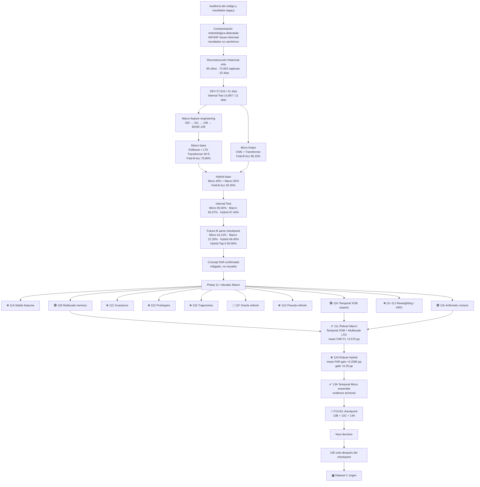

# LTD-Attack — Mapa ejecutivo de la investigación

> **Estado canónico de trabajo — 2026-10-04**
>
> Resumen visual de la trayectoria experimental desde la auditoría/reconstrucción hasta Phase 13.  
> Ver también: `EXPERIMENT_MAP.md` y `catalog/RESEARCH_BRANCHES.csv`.

## Leyenda

| Estado | Significado |
|---|---|
| ✅ CLOSED | Ejecutado, interpretado y cerrado |
| 🧊 FROZEN | Artefacto/configuración congelada |
| 🟢 POSITIVE | Señal útil, aunque no necesariamente promovida |
| ❌ REJECTED | Hipótesis descartada |
| 🧪 DIAGNOSTIC | Explica mecanismo; no es solución desplegable |
| 🚧 NEXT | Siguiente experimento |
| 🅿️ PARKED | Línea aplazada |
| 🔓 OPEN/FROZEN | Holdout ya observado; no puede usarse para selección nueva |

## Vista ejecutiva

## Qué está demostrado

1. **Concept Drift es severo.** Hybrid: **97.44% → 49.45% Accuracy**; Micro: **95.00% → 43.12%**.
2. **Hybrid mitiga, no elimina.** En Future-B supera a Micro en Accuracy (+6.34 pp), Macro-F1 (+5.13 pp), Top-5 (+8.17 pp) y MRR (+6.91 pp).
3. **XGBoost es la rama Macro más estable en Future-B**; LTD aporta identidad, pero su contexto longitudinal envejece.
4. **No funcionó intentar “borrar” el tiempo**: stable-only, invariance, prototypes y trajectories fueron descartados.
5. **La memoria stale sí explica parte del deterioro**, pero actualizarla online no es la solución final: el oracle ayuda, pseudo-refresh empeora.
6. **Dos mecanismos frozen dieron señal Macro:** multiscale memory (11B) y temporal XGB experts (11H).
7. **11L pasa el gate Macro:** +0.579 pp FAR Macro-F1 medio.
8. **12A no pasa al Hybrid:** +0.2095 pp < +0.2500 pp.
9. **13A es la señal más fuerte actual:** FAR Macro-F1 **69.88→73.47** y **77.39→86.71**; media **+6.45 pp**.
10. **P13-B1 es obligatorio antes de integrar:** 13B debe separar temporalidad específica de ensemble genérico; 13C y 14A se ejecutan en la misma batería sin selección adaptativa.

## Estado actual

- Arquitectura confirmatoria: **LTD-HYBRID-FINAL**.
- Candidato Macro robusto: **TEMPORAL_SYMMETRIC3 + MULTISCALE5**.
- Candidato Micro robusto principal: **13A temporal ensemble**.
- Próximo checkpoint: **P13-B1 (13B + 13C + 14A)**.
- Future-B: **abierto y congelado**; no se usa para selección nueva.
- ORIGIN14/ORIGIN28: **desarrollo repetido**, no validación externa.
- Dataset C: **validación externa virgen preferida**.

13A tiene `evidence archived`, `promotion_gate passed` y `Future-B unused`.
Los resultados de P13-B1 aún no existen y no se escriben en este mapa.

## Regla científica central

> La robustez longitudinal debe adquirirse durante el entrenamiento y mantenerse con inferencia congelada.  
> La meta es degradar más lentamente y espaciar reentrenamientos, no hacer continual learning.
